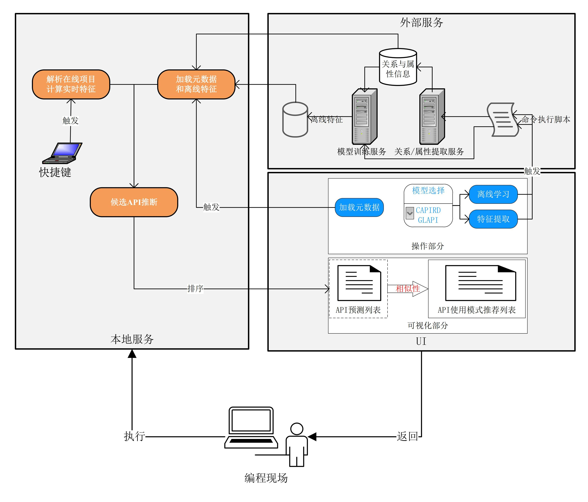
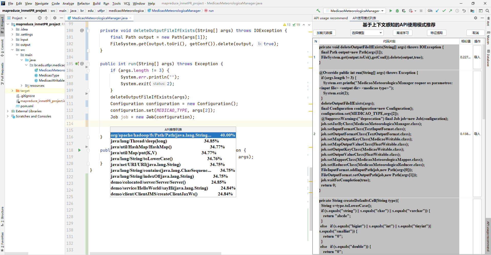

## 插件功能
在光标处，通过快捷键触发API预测及相关代码的推荐。通过可视化操作，调用外部服务，自动触发离线学习功能，并保存离线提取的元数据信息和特征数据。

## 插件设计
主要分成三个部分：UI、本地服务、外部服务。将外部模型的训练部分和预测部分进行分离，设计结构示意图如下：

## UI
用户功能交互界面，一个界面实现用户行为操作和内容输出，一个界面输出API推荐列表。主要有离线学习按钮，用来调用外部离线训练脚本，输入是模型类型和执行命令；特征提取按钮用来调用特征提取脚本，输入是当前开发者所在项目的结构和属性信息，及执行命令；模型选择下拉框用来选定外部模型，根据不同场景进行选择；加载元数据按钮，用来加载服务器上最新的元数据及结构和特征信息。

## 外部服务
主要进行特征提取和离线学习。特征提取包括对项目、方法和API的基本属性提取，和调用关系进行分析。属性是文本数据，需要进行编码，然后转化成结构化数据进行存储。结构信息转化成xml对象进行存储。离线学习加载所有结构信息和属性特征，选择合适模型进行训练，使得结构信息和属性信息融合，并保存结构化数据到服务器磁盘。

## 本地服务
主要是实时解析用户编程项目，并且提取实时特征。然后作为输入到加载的元数据中信息搜索和推断，结合概率预测和链接预测方法预测候选API，并以概率大小排序推荐。用户选择某个API时，以该API作为已选加入方法中，再根据方法的相似性搜索语料库中类似的代码片段进行推荐，根据相似性大小进行排序，从而完成API使用模式的推荐。

## 插件实现
根据以上内容，基于IntelliJ IDEA实现插件开发，使用PSI实现项目实时解析；基于Python和Java实现外部模型的导入，通过服务器脚本启动程序入口方法；基于Swing插件完成UI的可视化。插件实现API推荐的示意图如下：

## 插件演示
[API使用模式推荐演示](https://v.youku.com/v_show/id_XNTg3MTQ2MTc2NA==.html?spm=a1z3jc.11711052.0.0&isextonly=1)